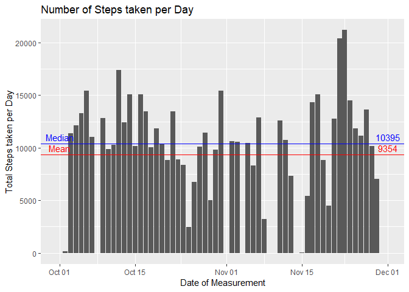
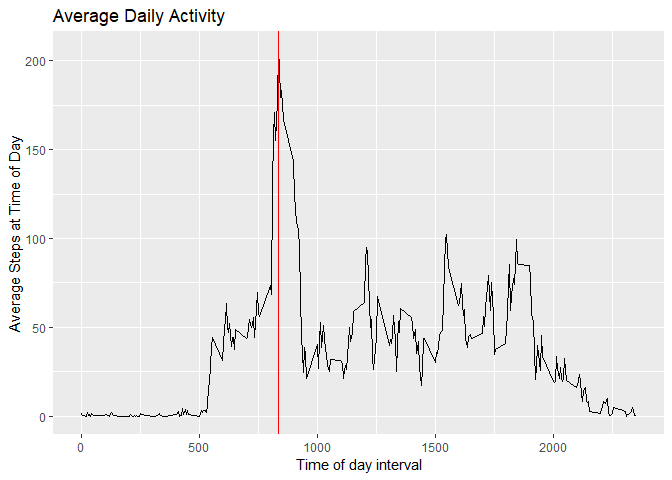
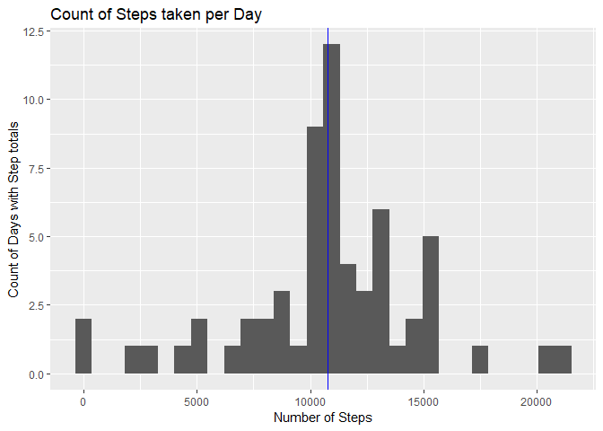
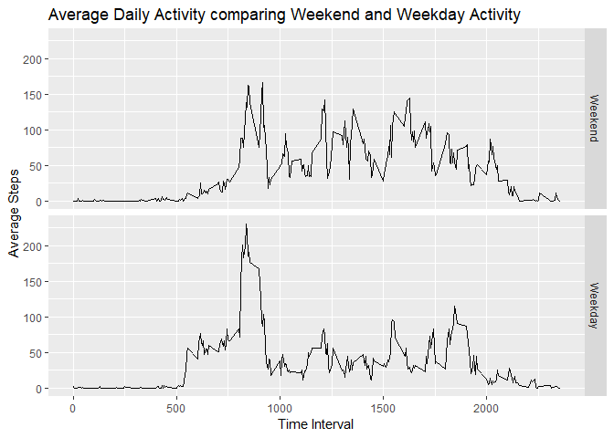

## Dependencies
The following libraries are used by this script:

```r
library(knitr)
library(ggplot2)
library(dplyr)
```

```
## 
## Attaching package: 'dplyr'
```

```
## The following objects are masked from 'package:stats':
## 
##     filter, lag
```

```
## The following objects are masked from 'package:base':
## 
##     intersect, setdiff, setequal, union
```

```r
library(readr)
library(lubridate)
```

```
## 
## Attaching package: 'lubridate'
```

```
## The following object is masked from 'package:base':
## 
##     date
```

## Constants
The following contstants will be  are used by this script:

```r
    dlzip="activity.zip"
    dlurl="https://d396qusza40orc.cloudfront.net/repdata%2Fdata%2Factivity.zip"
    datafilename="activity.csv"
```


## Loading and preprocessing the data
Download the file if it doesn't already exist in the workspace

```r
if(!file.exists(dlzip)){
    download.file(dlurl,dlzip)
    unzip(dlzip)
}
```
Read data into R and format the date variable data

```r
    activity<-read_csv(datafilename)
```

```
## Parsed with column specification:
## cols(
##   steps = col_integer(),
##   date = col_date(format = ""),
##   interval = col_integer()
## )
```

```r
    activity$date<-ymd(activity$date)
```


## What is mean total number of steps taken per day?
<!-- -->

```
## [1] "Mean  :  9354"
```

```
## [1] "Median:  10395"
```

## What is the average daily activity pattern?
<!-- -->

```
## [1] "Most Active Average Time Interval  :  835"
```


## Imputing missing values
Take the average step count for the time interval bin and assign it to the missing measurements

```
## [1] "Number of missing values:  2304"
```

<!-- -->

```
## [1] "Mean  :  10766"
```

```
## [1] "Median:  10766"
```
No change to mean (since mean values were imputted for missing measurements), but median has changed.


## Are there differences in activity patterns between weekdays and weekends?
<!-- -->

```
## [1] "Mean steps weekday: 10255"
```

```
## [1] "Mean steps weekend: 12201"
```


